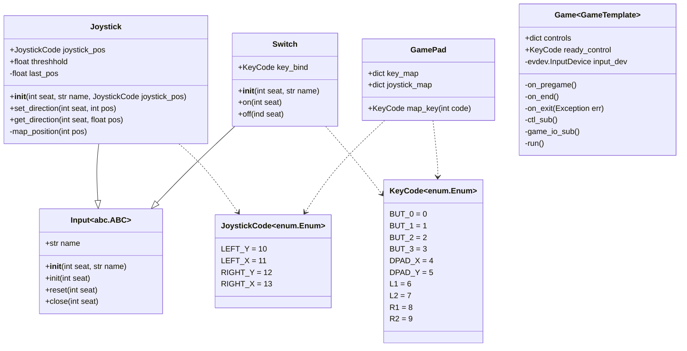

# Class structure for Controller

```mermaid
classDiagram
  class Input~abc.ABC~{
    +__init__(int seat, str name)
    +str name
    +init(int seat)
    +reset(int seat)
    +close(int seat)
  }

  class Joystick{
    +JoystickCode joystick_pos
    +float threshhold
    -float last_pos
    +__init__(int seat, str name, JoystickCode joystick_pos)
    +set_direction(int seat, int pos)
    +get_direction(int seat, float pos)
    -map_position(int pos)
  }
  Joystick --|> Input

  class JoystickCode~enum.Enum~{
    LEFT_Y = 10
    LEFT_X = 11
    RIGHT_Y = 12
    RIGHT_X = 13
  }
  Joystick ..> JoystickCode

  Switch --|> Input
  class Switch{
    +KeyCode key_bind
    +__init__(int seat, str name)
    +on(int seat)
    +off(ind seat)
  }

  class KeyCode~enum.Enum~{
    BUT_0 = 0
    BUT_1 = 1
    BUT_2 = 2
    BUT_3 = 3
    DPAD_X = 4
    DPAD_Y = 5
    L1 = 6
    L2 = 7
    R1 = 8
    R2 = 9
  }
  Switch ..> KeyCode

  class GamePad {
    +dict key_map
    +dict joystick_map
    +KeyCode map_key(int code)
  }
  GamePad ..> KeyCode
  GamePad ..> JoystickCode

  class Game~GameTemplate~{
    +dict controls
    +KeyCode ready_control
    -evdev.InputDevice input_dev
    -on_pregame()
    -on_end()
    -on_exit(Exception err)
    -ctl_sub()
    -game_io_sub()
    -run()
  }
```
