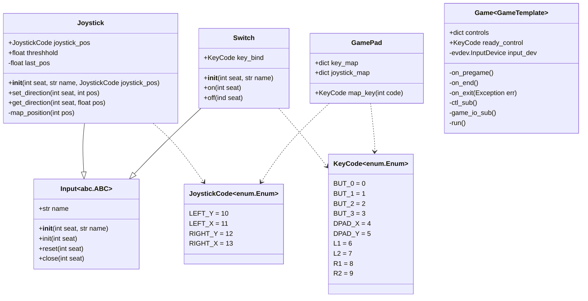

# Controller SDK

Controller are Raspberry Pi's wich control the game figures.

This module provides a `Game` class for a controller. The class is used to emit events debending on the game loop. The class also listens on gamepad inputs.

In addition the module provides a set of key maps for different gamepads.
To work with gamepad inputs the **controller sdk** provides as set of input classes.

## Class structure



## Create a game

## Create a game

### Game

To create a new game write a class wich inherits from `Game`.

```python
class MyGame(Game):
```

Now the methods:

 - `on_pregame()` -> **start** State
 - `on_start()`   -> **run** State
 - `on_end()`     -> **end** State
 - `on_exit()`    -> programm exit

To start the game you have to execute `MyGame.run()`.

```python
if __name__ == "__main__"
  game = MyGame()
  game.run('path/to/config.toml')
```

!!! NOTE
    Don't forget creating a config file according to the [specifications](config-file.md)


### Inputs

The heart of this SDK is the ability to react on gampad inputs. Those inputs can be handled with `Input` classes.

To create an input write a class witch inherits from `Switch` odr `Joystick`. The use of those classes is described below. Important is, that every `Input` class has the following methods:

- `init(seat: int)` - Executed before the start of a game
- `reset(seat: int)` - Executed when a game ends
- `close(seat: int)` - Executed on program exit

Any input has to be registered in your `Game` class. This is necessary so that they can be called when an user input is detected. You can register an input by adding it to the `controls` dictionary of your `Game` class. As key you use the desired `KeyCode` ore `JoystickCode`

```python
self.controls = {
  KeyCode.BUT_0 = MySwitch(seat, 'MY_SWITCH')
}
```

#### Switch

The `Switch` class is used to work with any binary input. It provides two functions:

- `on(seat: int)`
- `off(seat: int)`

wich are called when the putten is pressed and released respectively.

```python
class MySwitch():
  async def on(seat: int):
    print("Button pressed")

  async def off(seat: int):
    print("Button released")
```

#### Joystick

As the name implies, the `Joystick` class is used for inputs from one dimension of a joystick. It provides a method `get_direction(seat: int, pos: int)` which is called with a new joystick position between $$-1$$ and $$1$$.

Additionally a constant `THRESHOLD` is given. With this value you can deside below wich value an input is recognized as zero.

```python
class MyJoystick()
  def __init__(seat: int, name: str):
    super().__init__(seat, name)

    self.THRESHOLD = 0.25

  async def get_direction(seat: int, pos: float):
    print(f"Position of joystick changed to {pos}")
```