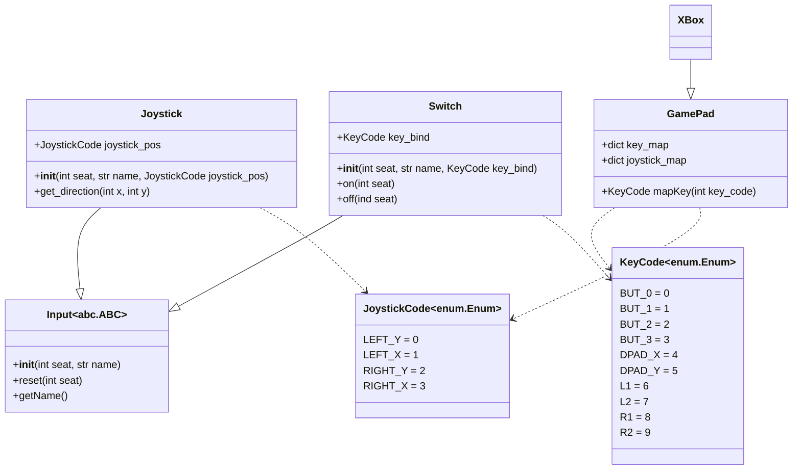
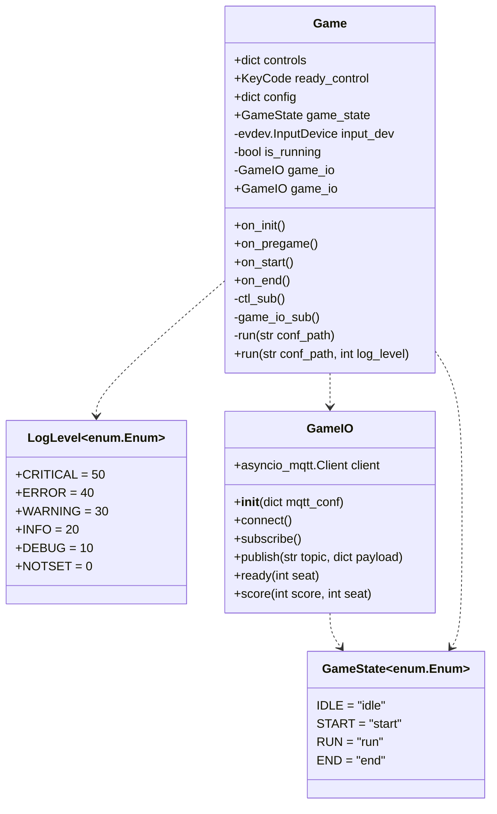

# Game SDK for Controller

## Structure

### Controls

```mermaid
classDiagram
  class Input~abc.ABC~{
    +__init__(int seat, str name)
    +reset(int seat)
    +getName()
  }

  class Joystick{
    +JoystickCode joystick_pos
    +__init__(int seat, str name, JoystickCode joystick_pos)
    +get_direction(int x, int y)
  }
  Joystick --|> Input

  class JoystickCode~enum.Enum~{
    LEFT_Y = 0
    LEFT_X = 1
    RIGHT_Y = 2
    RIGHT_X = 3
  }
  Joystick ..> JoystickCode

  Switch --|> Input
  class Switch{
    +KeyCode key_bind
    +__init__(int seat, str name, KeyCode key_bind)
    +on(int seat)
    +off(ind seat)
  }

  class KeyCode~enum.Enum~{
    BUT_0 = 0
    BUT_1 = 1
    BUT_2 = 2
    BUT_3 = 3
    DPAD_X = 4
    DPAD_Y = 5
    L1 = 6
    L2 = 7
    R1 = 8
    R2 = 9
  }
  Switch ..> KeyCode

  class GamePad {
    +dict key_map
    +dict joystick_map
    +KeyCode mapKey(int key_code)
  }
  GamePad ..> KeyCode
  GamePad ..> JoystickCode

  class XBox {
  }
  XBox --|> GamePad
```

### Game

```mermaid
classDiagram
  class Game{
    +dict controls
    +KeyCode ready_control
    +dict config
    +GameState game_state
    -evdev.InputDevice input_dev
    -bool is_running
    -GameIO game_io
    +GameIO game_io
    +on_init()
    +on_pregame()
    +on_start()
    +on_end()
    -ctl_sub()
    -game_io_sub()
    -run(str conf_path)
    +run(str conf_path, int log_level)
  }

  class LogLevel~enum.Enum~{
    +CRITICAL = 50
    +ERROR = 40
    +WARNING = 30
    +INFO = 20
    +DEBUG = 10
    +NOTSET = 0
  }
  Game ..> LogLevel

  class GameIO{
    +asyncio_mqtt.Client client
    +__init__(dict mqtt_conf)
    +connect()
    +subscribe()
    +publish(str topic, dict payload)
    +ready(int seat)
    +score(int score, int seat)
  }
  Game ..> GameIO


  class GameState~enum.Enum~{
    IDLE = "idle"
    START = "start"
    RUN = "run"
    END = "end"
  }
  GameIO ..> GameState
  Game ..> GameState
```
