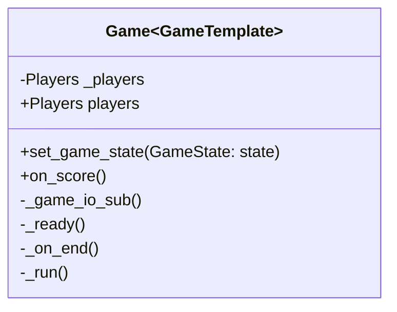

# Gamecontrol SDK

The Gamecontrol is the center of the game. You can think of it like a referee. The Gamecontrol controls the game loop and decides wich player won. In order to achieve this, the module provides a `Game` class.

The `Game` class provides events depending on the game state as well as a method to change it.

## Class structure



## Create a game

To create a new game write a class wich inherits from `Game`.

```python
class MyGame(Game):
```

Now the methods:

 - `on_pregame()` -> **start** State
 - `on_start()`   -> **run** State
 - `on_end()`     -> **end** State
 - `on_exit()`    -> programm exit
 - `on_score()`   -> score

can be overridden with custom code. They will be executed on their coresponding event. To access the score of a player the `players` variable can be used.

```python
class MyGame(Game):

  async def on_score(seat: int):
    for seat, score in self.players.score.items():
      print(f"Player {seat} has {score} Points")
```

Most states of the game loop are changed automatically depending on the different controllers and other devices. The exception is the switch from **run** to **end**. This must be changed by you.

```python
class MyGame(Game):

  async def on_score(seat: int):
    for seat, score in self.players.score.items():
      print(f"Player {seat} has {score} Points")

      # find winner
      if score >= self.max_score:
        print(f"Player {seat} wins!!!")
        await self.set_game_state(GameState.END)
```

To start the game you have to execute `MyGame.run()`.

```python
if __name__ == "__main__"
  game = MyGame()
  game.run('path/to/config.toml')
```

!!! NOTE
    Don't forget creating a config file according to the [specifications](config-file.md)