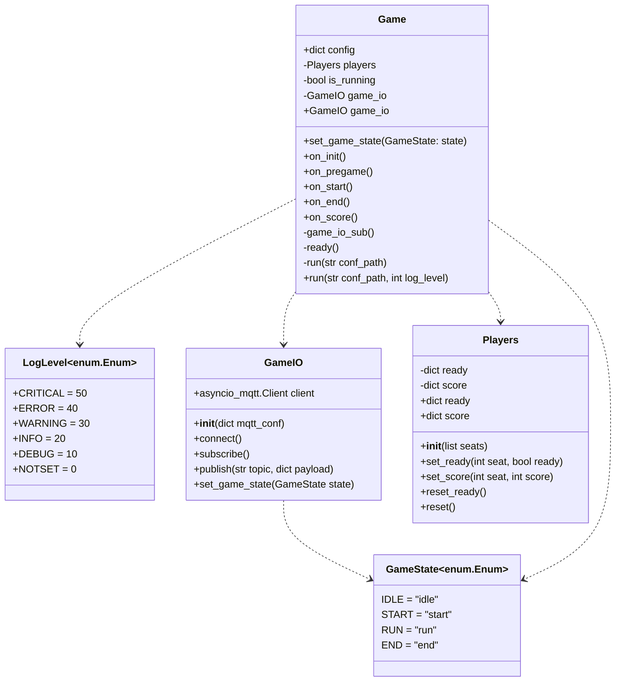

# Game SDK for Gamecontrol

## Structure

```mermaid
classDiagram
  class Game{
    +dict config
    -Players players
    -bool is_running
    -GameIO game_io
    +GameIO game_io
    +set_game_state(GameState: state)
    +on_init()
    +on_pregame()
    +on_start()
    +on_end()
    +on_score()
    -game_io_sub()
    -ready()
    -run(str conf_path)
    +run(str conf_path, int log_level)
  }

  class LogLevel~enum.Enum~{
    +CRITICAL = 50
    +ERROR = 40
    +WARNING = 30
    +INFO = 20
    +DEBUG = 10
    +NOTSET = 0
  }
  Game ..> LogLevel

  class GameIO{
    +asyncio_mqtt.Client client
    +__init__(dict mqtt_conf)
    +connect()
    +subscribe()
    +publish(str topic, dict payload)
    +set_game_state(GameState state)
  }
  Game ..> GameIO


  class GameState~enum.Enum~{
    IDLE = "idle"
    START = "start"
    RUN = "run"
    END = "end"
  }
  GameIO ..> GameState
  Game ..> GameState

  class Players {
    -dict ready
    -dict score
    +dict ready
    +dict score
    +__init__(list seats)
    +set_ready(int seat, bool ready)
    +set_score(int seat, int score)
    +reset_ready()
    +reset()
  }
  Game ..> Players
```