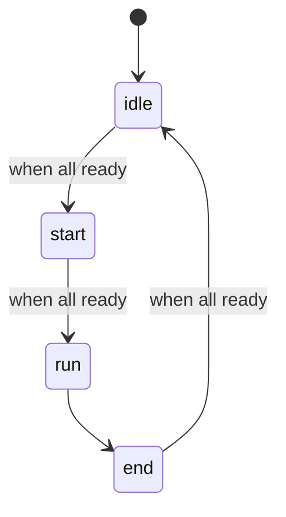

# 4D-Game SDK

The 4D-Game SDK allows you to create a physical Game wich can be controlled with a Gamepad over a Raspberry Pi. To create a game, every Player (Gamepad) gets it's own Raspberry Pi (**Controller**). The control of the Game is done by one Raspberry Pi called the **Gamecontrol**.

## Gameloop

The course of every game can be described by a state machine called the gameloop. It is consisting of the _idle-_, _start-_, _run-_ and _end-_States wich are controlled by the **Gamecontrol**.

### States
#### Idle
The gameloop starts in the _idle_-State, waiting until every controller send a ready message. When this happens the state is changed to _start_.

#### Start
The start state is used to initialize different devices needed for the game and get everything into starting position. The state is changed to _run_ when every controller sent a ready message.

#### Run
This is the state where the actual game is played. Player can gain or loose points or a timer is running to end the game after a certain time. When the condition for the end of a game/round is met, the state is changed to _end_.

#### End
In this state devices needed for the game can be deinitialized so they are not running in idle state. When every controller is ready, the gamecontrol switches back to _idle_.

## Communication

All communication between different Devices is done with MQTT. The following structure is used:

### MQTT Structure

## Create a game

A simple game consists at least of:

- 1x Controller
- 1x Gamecontrol

The number of Controller can be increased up to 8.[^1]

You can also have an element in your game that get's all information but doesn't interact with the game loop (e.g. A display to show the score of a player). For this the **passive sdk** can be used. The number of passive devices is not restricted.[^2]

To learn how to get started with the different parts of the sdk see the following sections:

- [Controller - Getting Started](controller-sdk/index.md)
- [Gamecontrol - Getting Started](gamecontrol-sdk/index.md)
- [Passive - Getting Started](passive-sdk/index.md)

[^1]: Tested with 8 but it should work with more.
[^2]: Only tested with one.