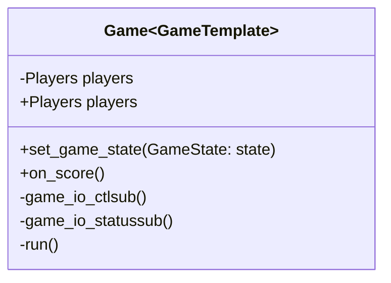

# Class structure for passive devices

```mermaid
classDiagram
  class Game~GameTemplate~{
    -Players players
    +Players players
    +set_game_state(GameState: state)
    +on_score()
    -game_io_ctlsub()
    -game_io_statussub()
    -run()
  }
```