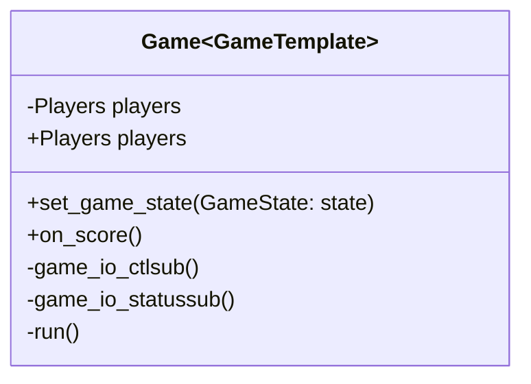

# Passive SDK

The **passive sdk** is used for devices wich wont interact with game. Instead passive devices can be used to display the score or similar.

As the other modules the **passive sdk** provides a `Game` Class wich emits events debending on the game state.

## Class structure



## Create a Game

To create a new game write a class wich inherits from `Game`.

```python
class MyGame(Game):
```

Now the methods:

 - `on_pregame()` -> **start** State
 - `on_start()`   -> **run** State
 - `on_end()`     -> **end** State
 - `on_exit()`    -> programm exit
 - `on_score()`   -> score

can be overridden with custom code. They will be executed on their coresponding event. To access the score of a player the `players` variable can be used.

```python
class MyGame(Game):

  def on_score(seat: int):
    for seat, score in self.players.score.items():
      print(f"Player {seat} has {score} Points")
```

To start the game you have to execute `MyGame.run()`.

```python
if __name__ == "__main__"
  game = MyGame()
  game.run('path/to/config.toml')
```

!!! NOTE
    Don't forget creating a config file according to the [specifications](../gamecontrol-sdk/config-file.md)