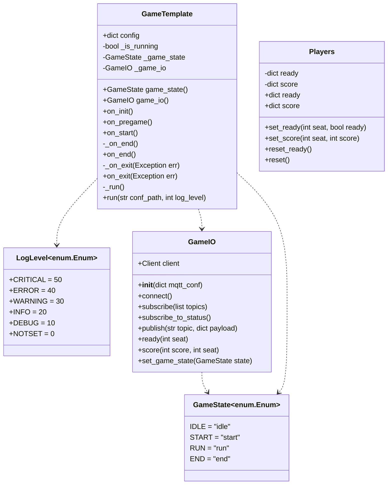

# 4D-Game SDK Structure

The 4D-Game SDK is based on the classes shown below. The structure is extended by the classes specifically used for controller, gamecontrol or passive devices. Those classes are explained in the coresponding section.

## GameTemplate

The `GameTemplate` class is the base for the different `Game` classes for controller, gamecontrol and passive elements.

## GameIO

The `GameIO` gives access to the gameloop and communication between devices. It is instanciated in the `Game` class and can be used with `self.game_io`.

## Players

The `Players` class is used by the gamecontrol and passive devices. It provides an easy interface to save the score and the ready flag of all connected controllers.