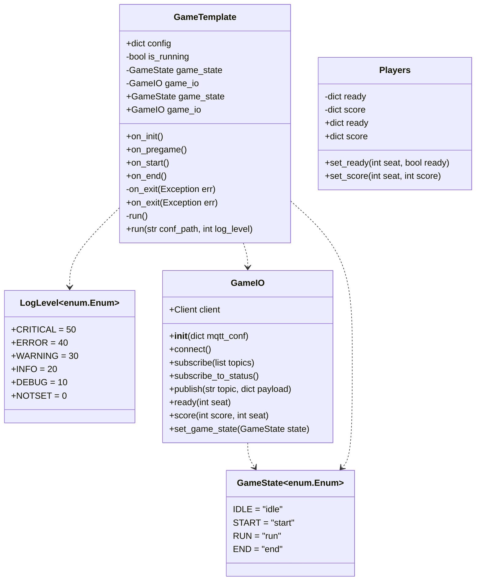

# Game SDK Structure

```mermaid
classDiagram
  class GameTemplate{
    +dict config
    -bool is_running
    -GameState game_state
    -GameIO game_io
    +GameState game_state
    +GameIO game_io
    +on_init()
    +on_pregame()
    +on_start()
    +on_end()
    -on_exit(Exception err)
    +on_exit(Exception err)
    -run()
    +run(str conf_path, int log_level)
  }

  class LogLevel~enum.Enum~{
    +CRITICAL = 50
    +ERROR = 40
    +WARNING = 30
    +INFO = 20
    +DEBUG = 10
    +NOTSET = 0
  }
  GameTemplate ..> LogLevel

  class GameIO{
    +Client client
    +__init__(dict mqtt_conf)
    +connect()
    +subscribe(list topics)
    +subscribe_to_status()
    +publish(str topic, dict payload)
    +ready(int seat)
    +score(int score, int seat)
    +set_game_state(GameState state)
  }
  GameTemplate ..> GameIO

  class GameState~enum.Enum~{
    IDLE = "idle"
    START = "start"
    RUN = "run"
    END = "end"
  }
  GameIO ..> GameState
  GameTemplate ..> GameState

  class Players {
    -dict ready
    -dict score
    +dict ready
    +dict score
    +set_ready(int seat, bool ready)
    +set_score(int seat, int score)
  }
```